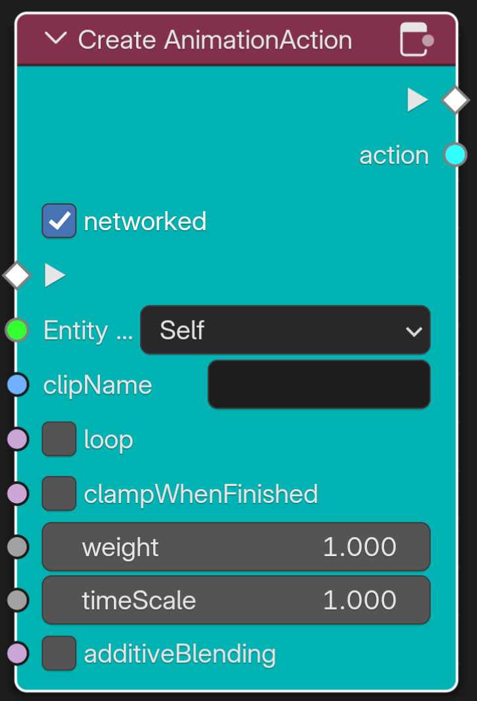
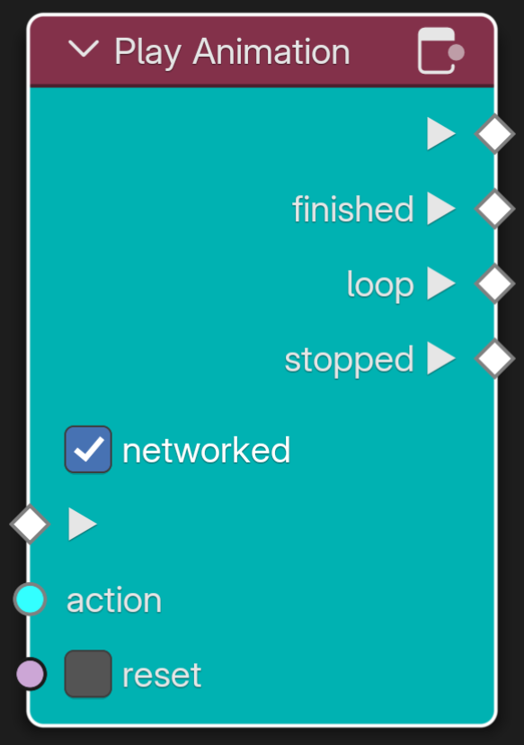
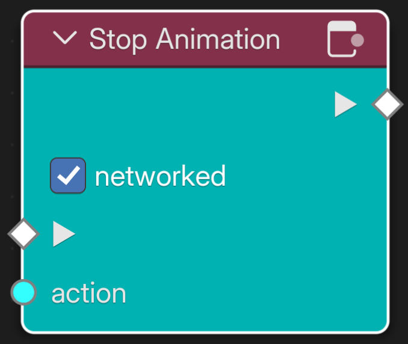
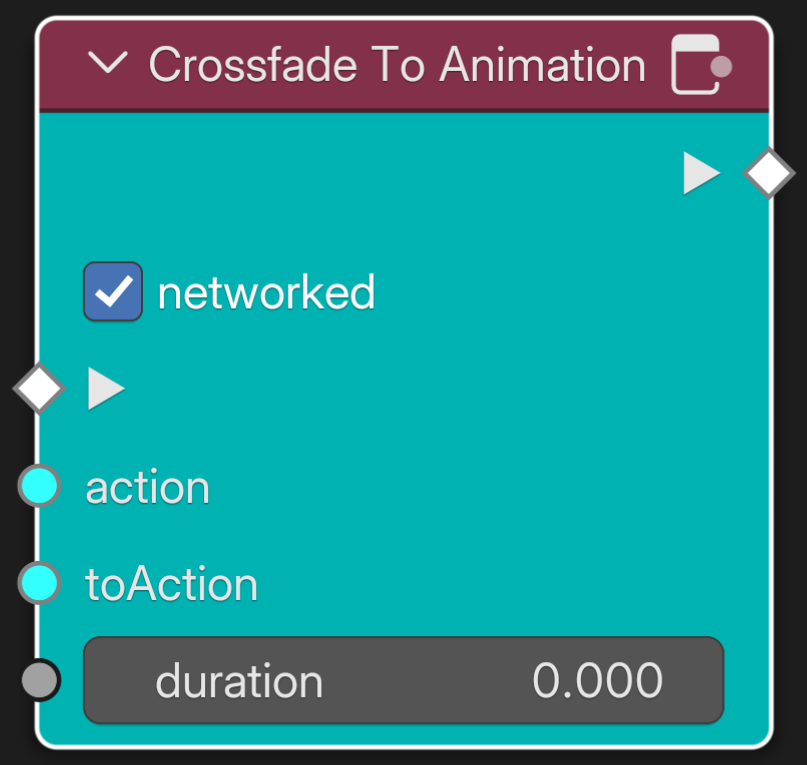
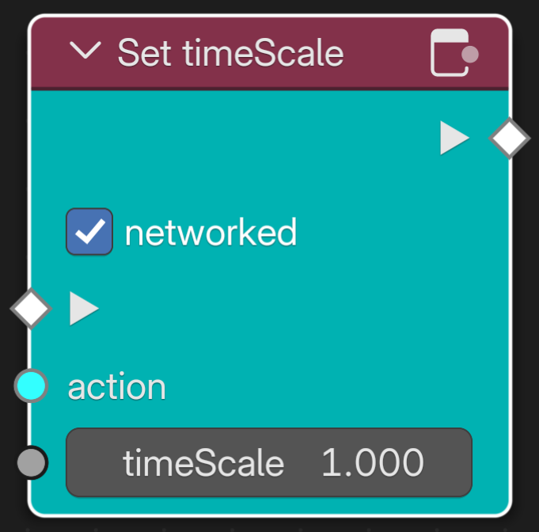
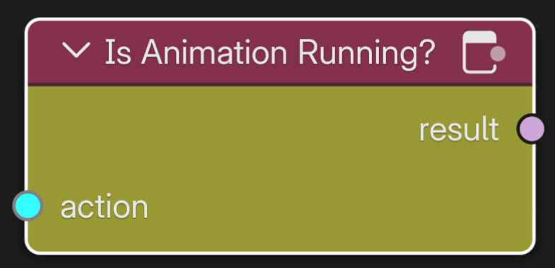

> **NOTE:** _As of this documentation being created, Behavior Graphs are undergoing rapid development. This makes it challenging to update this documentation quickly enough to make sure it has parity with the current state of the tech behind it. Thank you for your patience and please consider contributing edits to this documentation as needed._

- [Intro to Behavior Graphs](./intro-behavior-graphs.md)
- [List of Flow Nodes](./nodes-flow.md)
- [List of Event Nodes](./nodes-event.md)
- List of Animation Nodes
- [Variable Types](./variable-types.md)

---
# Animation Nodes

The **Animation Nodes** in **Behavior Graphs** are used to initialize and control all kinds of animation.

_Note_: They are not to be confused with the popular Animation Nodes addon for Blender
## Create AnimationAction

\
_The node **On Start** will get triggered when the room is fully loaded._

**Create AnimationAction** is the starting point when controlling animations with Behavior Graphs. It initializes a Blender action by it's **clipName**, which is the name of the action datablock in Blender, and binds it to an **Entity**. An example would be a jumping animation that moves the object up and then down again. The playback of the animation can be **networked** which means that it will be seen by all players in the room. **Loop** will make the animation repeat over and over while **clampWhenFinished** will make the animation freeze on the last frame when ended. **Weight** acts like a multiplier to the animation. In the example of the jumping animation a weight >1.0 would make it jump higher than animated. The **timeScale** defines the relative speed of the animation. It can be negative to make the animation run backwards. **additiveBlending** will make the action not replace the effect of existing actions but rather add the animation on top of any exisiting ones.

Output is the **action** that is now ready to be used.

## Play Animation

\
_The node **Play Animation** will play back an **action** and optionally **reset** it._

**Play Animation** start the playback of an **action**. When **reset** is checked or set to **True**, the animation will go back to the beginning once it has finished playing. When **networked** is checked, the animation is visible to every avatar in the room.
The node triggers an **Event** when the animation is **finished** or has **stopped**. If the animation runs in a loop, the node will instead trigger an **Event** when the loop starts over. 

## Stop Animation

\
_The node **Stop Animation** will stop the playback of an **action**._

**Stop Animation** stops the playback of an **action**. When **networked** is checked, the animation will stop for every avatar in the room.

## Crossfade To Animation

\
_The node **Crossfade To Animation** will fade from **action** to **toAction** in **duration** seconds._

**Crossfade To Animation** interpolates from **action** to **toAction** in **duration** seconds. When **networked** is checked, the animation will stop for every avatar in the room.
Use this node when you want a smooth transition from one animation to another.

## Set timeScale

\
_The node **Set timeScale** sets the speed an **action** is running at._

**Set timeScale** changes the speed of an **action**. The **timeScale** also takes negative values which means you can use the node to reverse the direction of an animation. When **networked** is checked, the animation will stop for every avatar in the room.
This node comes in handy when animating things like doors because instead of two seperate animations for open and closing the door, the door can be closed by setting the timeScale of the opening animation to a negative value.

## Is Animation Running

\
_The node **Is Animation Running** checks whether an **action** is currently running and outputs the **result** as a boolean._

**Is Animation Running** outputs True or False depending on whether the animation stored in **action** is currently running or not.

[Back to the Intro to Behavior Graphs](./intro-behavior-graphs.md)