> **NOTE:** _As of this documentation being created, Behavior Graphs are undergoing rapid development. This has the effect of making it challenging to update this documentation quickly enough to make sure it has parity with the current state of the tech behind it. Thank you for your patience and please consider contributing edits to this documentation as needed._

# Event Nodes

Event nodes are the starting point for a Behavior Graph because events are what starts the flow of information. For example clicking on an object could change the material or make it rotate. Event nodes do not have an Event input themselves but they can have other inputs that help set parameters for the node's execution.

## Livecycle Events

**Livecycle Events** get triggered when a room is created, gets shut down or as long as it exists.

### On Start

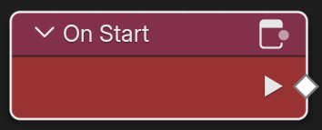\
_The node **On Start** will get triggered when the room is fully loaded._

**On Start** gets triggered when the room has finished loading. Use this for things that need to be initialized from the very beginning.

[//]: # (I cannot find a way to trigger On End)

### On End

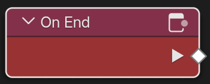\
_The node **On End** will get triggered when the room is shut down._

**On End** gets triggered when the room is shut down. Use this for cleaning things up before exit.

### On Tick

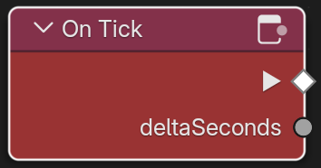\
_The node **On Tick** will get triggered for every frame._

**On Tick** gets triggered for every frame or whenever the scene updates. The output _deltaSeconds_ yields a Float value of the time the current frame took to execute in seconds.

## Entity Events

**Entity Events** are events that get triggered by an entity. That can either be because the user is interacting with them or via collisions.

### On Interact

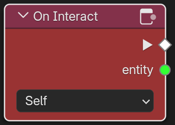\
_The node **On Interact** will get triggered when the user clicks on the entity._

**On Interact** gets triggered when the user interacts with an entity. Usually that means the user clicking on the object specified in the dropdown menu. By default it is set to self but when set to **Other** an object selection field with picker shows up where you can set a **Target** object. Output is the Event and the Entity that has been interacted with. Use this node whenever you want the user to be able to click on something.

### On Collision Enter

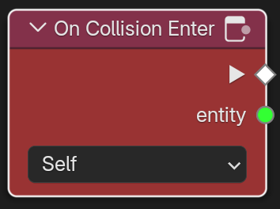\
_The node **On Collision Enter** will get triggered when another object collides with the entity._

**On Collision Enter** gets triggered when another object collides with the entity. For that to work both objects needs to have a _RigidBody_ component. By default it is set to **Self** but it can be set to a **Target** object by selecting **Other** in the dropdown.

### On Collision Stay

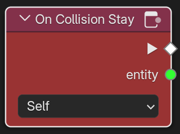\
_The node **On Collision Stay** will get triggered for every tick as long as the object is inside the other entity._

**On Collision Stay** gets triggered when another object is inside the entity. It then fires one Event per _Tick_. For the node to work both objects needs to have a _RigidBody_ component. By default it is set to **Self** but it can be set to a **Target** object by selecting **Other** in the dropdown.

### On Collision Exit

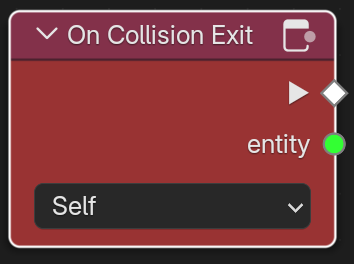\
_The node **On Collision Exit** will get triggered when another object moves out of the entity._

**On Collision Exit** gets triggered when another object that has been inside the entity leaves it. For that to work both objects needs to have a _RigidBody_ component. By default the node is set to **Self** but it can be set to a **Target** object by selecting **Other** in the dropdown.

---
## Player Events

**Player Events** are events that get triggered by a player. An example would be entering or exiting the room or when the player collides with a trigger object.

### On Player Collision Enter

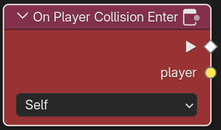\
_The node **On Player Collision Enter** will get triggered when the user collides with a trigger object._

**On Player Collision Enter** gets triggered when the user collides with an entity that has a _RigidBody_ component that is set to trigger Avatar collisions. Output is the Event and the player object of the user who collided with the entity. By default the node is set to **Self** but it can be set to a **Target** object by selecting **Other** in the dropdown.

### On Player Collision Stay

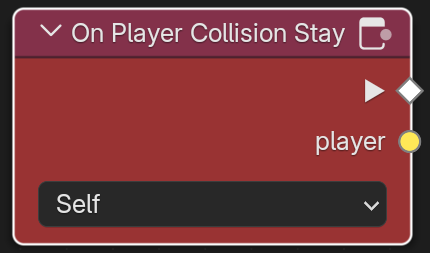\
_The node **On Player Collision Stay** will get triggered on every tick as long as a player is standing inside the trigger object._

**On Player Collision Stay** gets triggered when the user collides with an entity that has a _RigidBody_ component that is set to trigger Avatar collisions. Output is the Event and the player object of the user who collided with the entity. By default the node is set to **Self** but it can be set to a **Target** object by selecting **Other** in the dropdown.

### On Player Collision Exit

\
_The node **On Player Collision Exit** will get triggered when the user moves out of a trigger object._

**On Player Collision Exit** gets triggered when the user leaves an object that has a _RigidBody_ component that is set to trigger Avatar collisions. Output is the Event and the player object of the user who collided with the entity. By default the node is set to **Self** but it can be set to a **Target** object by selecting **Other** in the dropdown.

### On Player Joined

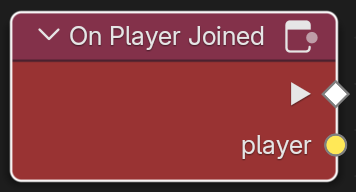\
_The node **On Player Joined** will get triggered when a user joines the room._

**On Player Joined** gets triggered whenever a user joins the room. Output is the Event and the player object of the user who joined the room.

### On Player Left

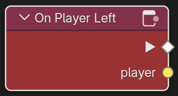\
_The node **On Player Left** will get triggered when a user has left the room._

**On Player Left** gets triggered whenever a user leaves the room. Output is the Event and the player object of the user who joined the room.

## Custom Triggers

### Trigger

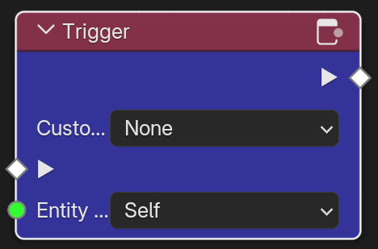\
_The node **Trigger** will trigger a custom event._

**Trigger** is the only Event node with an Event input socket. When triggered, it will trigger a custom event that in turn can trigger an **On Trigger** node. The event can be triggered on the entity itself but also on other entities, the **Scene Graph** and the current behavior graph. Use this when you want to pass information across entities or when you want to limit an event to only the graph it is currently in.

### On Trigger

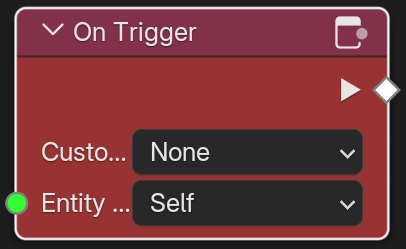\
_The node **Trigger** will get triggered by a custom event._

**On Trigger** will get triggered when a custom event gets triggered. That way information can be passed accross objects and also the scene graph.

[Back to the Intro to Behavior Graphs](./intro-behavior-graphs.md)