> **NOTE:** _As of this documentation being created, Behavior Graphs are undergoing rapid development. This has the effect of making it challenging to update this documentation quickly enough to make sure it has parity with the current state of the tech behind it. Thank you for your patience and please consider contributing edits to this documentation as needed._

- [Intro to Behavior Graphs](./intro-behavior-graphs.md)
- List of Flow Nodes
- [List of Event Nodes](./nodes-event.md)
- [List of Animation Nodes](./nodes-animation.md)
- [Variable Types](./variable-types.md)

---
# Flow Nodes

Flow Nodes are changing the Flow of information or events. Clicking twice on an entity can thus trigger something different than a single click. You can also create toggles via **Flip-Flop** and more complex forms of interaction and information flow.

## Sequence

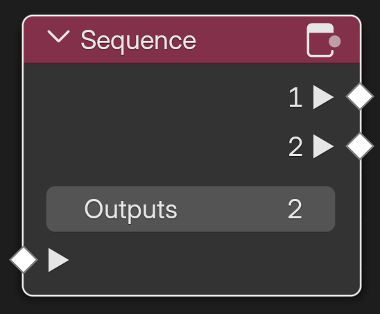\
_The node **Sequence** duplicates an **Event** as many times as there are **Outputs**._

**Sequence** will create as many copies of an Event as there are **Outputs** defined and send them forth one-by-one.

## Branch

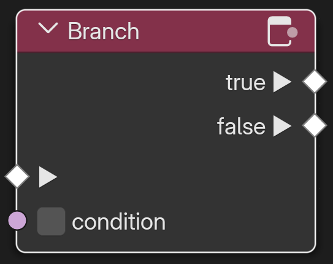\
_The node **Branch** sends an Event forth based on a **Boolean** condition._

**Branch** sends an Event to different output sockets based on a _Boolean_ Condition. If **True** it will send the Event to the upper output socket, in case of **False** to the lower one.

## Counter

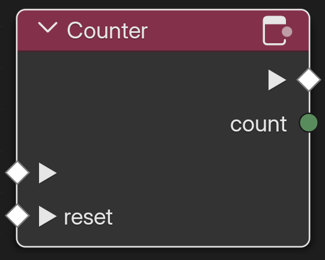\
_The node **Counter** counts the number of events flowing through._

**Counter** counts the number of times an event is flowing through it and outputs it via an **Integer** socket. The **reset** can optionally be connected with an event that sets the counter back to zero.

## Debounce

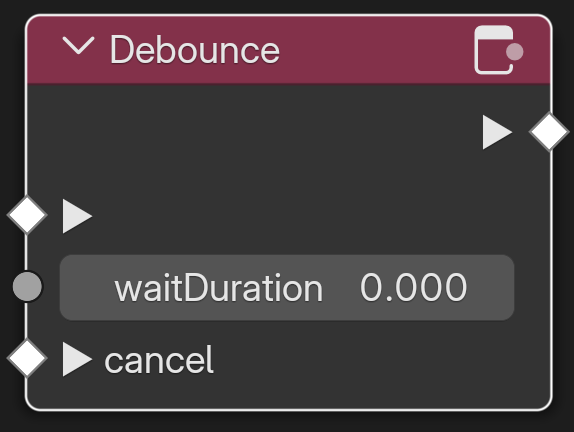\
_The node **Debounce** will prevent that Events happen too close together time-wise._

**Debounce** prevents an Event from flowing through the node again unless the **waitDuration** has passed. This helps to prevent things like the user unintentionally clicking twice. You also have the option to **cancel** the waiting via another Event.

## DoN

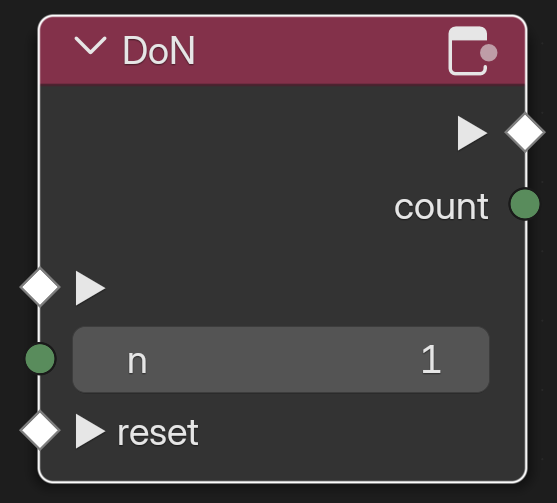\
_The node **DoN** will pass an Event through up to **n** times._

**DoN** will forward an Event up to **n** times. The number of times this has happened can be retrieved via the **count** output. You can set the counter back to zero via the **reset** Event input socket.

## DoOnce

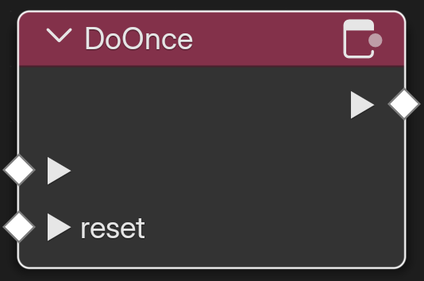\
_The node **DoOnce** will forward an event only one time._

**DoOnce** will foward an event exactly one time unless it is **reset**. This node is essentially a simplified version of the DoN node.

## Flip Flop

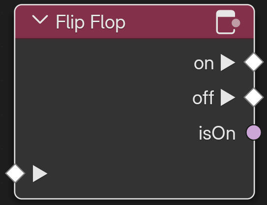\
_The node **Flip Flop** switches between **on** and **off**._

**Flip Flop** switches back and forth between **on** and **off**. The current state can be read via the boolean **isOn** output socket. This node comes in handy when you have a switch like for turning the lights on and off or a door that can be opened and closed.

## For Loop

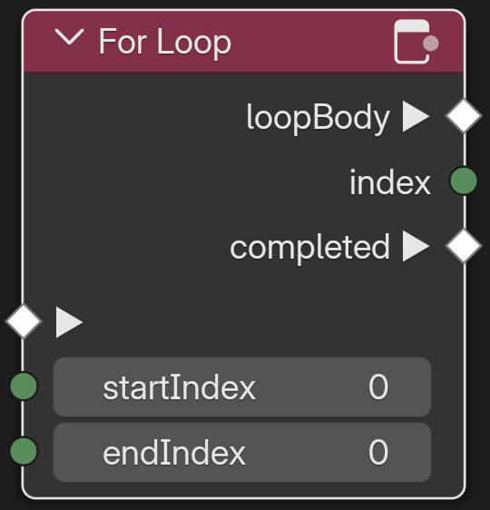\
_The node **For Loop** gets triggered **endIndex** - **startIndex** times._

**For Loop** runs **endIndex** - **startIndex** times and puts out an event and the current index of the loop as integer. The output Events are split into **loopBody** which will get triggered as long as **index** < **endindex** and **completed** when **index** == **endIndex**.

## Gate

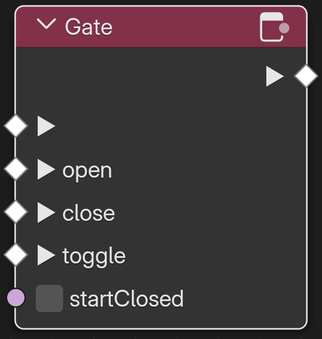\
_The node **Gate** will forward the trigger Event as long as it is set to open. It can be opened, closed and toggled via Events._

**Gate** will pass through an event as long as the gate node is set to open. It can be set to **open** or **close** via Event inputs and also **toggle**d. If you want to initialize the node with the gate being set to **close**, you can use the **startClosed** boolean input.

## MultiGate

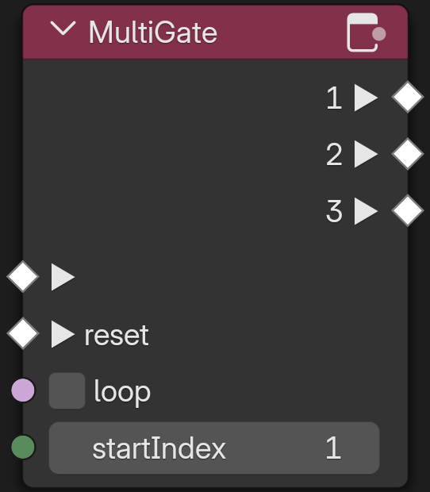\
_The node **MultiGate** ._

**MultiGate** will forward an Event to different output depending on how often it has been triggered. It can be **reset** to start again and set to **loop** via a boolean input, which will reset it to the first output automatically once the third output is reached. Using **startIndex** you can define which output is used the first time the node gets triggered. Beware that the index starts at 0 so startIndex of 1 means that the first time the gate will foward to the second output.

## Throttle

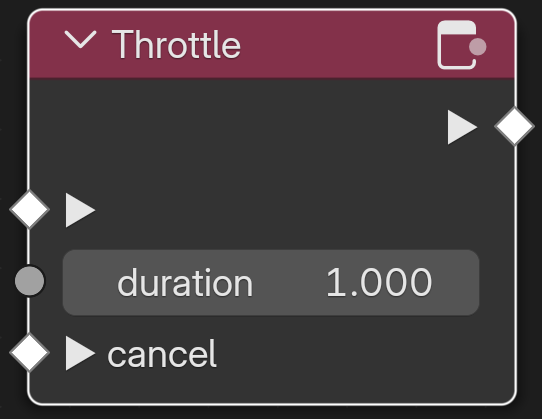\
_The node **Throttle** will wait for **duration** seconds before forwarding the Event._

**Throttle** forwards an Event after **duration** seconds. It comes in handy when things are in need of syncing up or when you want to give the user a break.

[Back to the Intro to Behavior Graphs](./intro-behavior-graphs.md)