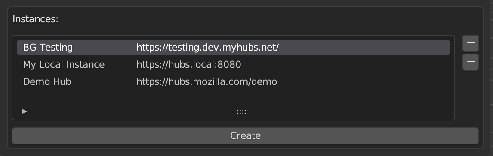

# Behavior Graphs
The Behavior Graphs Blender add-on adds support for authoring Hubs compatible Behavior Graphs inside Blender. A behavior graph is a series of interconnected nodes that represent behaviors and interactions in a 3D asset. It can respond to events and cause changes in the asset’s appearance and behavior. 

This implementation of Behavior Graphs is is based on the Khronos [KHR_interactivity](https://github.com/KhronosGroup/glTF/blob/interactivity/extensions/2.0/Khronos/KHR_interactivity/Specification.adoc) spec and it will be updated to align with the `KHR_interactivity` spec as it evolves. 

For more information:
- https://www.khronos.org/blog/deliver-interactive-experiences-with-gltf-a-node-graph-based-approach
- https://github.com/KhronosGroup/glTF/blob/interactivity/extensions/2.0/Khronos/KHR_interactivity/Specification.adoc

## Disclaimer

This add-on is in early Alpha state and continuously evolving so backwards compatibility won't be always a priority.  **Don't use this code in production**.

# Documentation
You can read an intro to Behavior graphs here: [Behavior Graphs Intro](docs/intro-behavior-graphs.md).

# Installation and Basic Usage
This add-on is only compatible with **Blender 3.6** and it's not yet compatible with versions above that.

This add-on requires the [Mozilla Hubs Blender Exporter Addon](https://github.com/MozillaReality/hubs-blender-exporter). You'll need both installed and the Hubs Blender Exporter add-on needs to be loaded before the Behavior Graphs add-on is.

Behavior graphs is still in alpha state and not part of the main Hubs client branch. That means it will not work on regular hubs instances or on the official hubs demo server. 

There are three ways you can test Behavior Graphs:
- The public testing instance
- Your own local instance using [Hubs Compose](https://github.com/mozilla/hubs-compose/)
- Your own Hubs instance

## Testing instance
For testing, you can use the [public testing instance](https://testing.dev.myhubs.net/). This instance will be regularly updated with the development branch so you can expect it to have the latest code running anytime.

To use the testing instance you'll need to add the instance home URL to your server list.

## Hubs compose
Alternatively, you can use [hubs-compose](https://github.com/mozilla/hubs-compose/) to run the whole stack locally. 

To add support for Behavior Graphs in your Hubs Compose based instance you'll need to checkout the Hubs client [add-ons branch](https://github.com/mozilla/hubs/tree/addons) and install the [Hubs Behavior Graphs add-on](https://github.com/MozillaReality/hubs-behavior-graphs-addon/).

To use your local Hubs Compose instance you'll need to add the instance home URL to your server list.

## Your own Hubs instance
If you are lucky enough to have your own Hubs instance or have access to client customization in your favorite Hubs provider, you add Behavior Graphs support by using the [add-ons branch](https://github.com/mozilla/hubs/tree/addons) and installing the [Hubs Behavior Graphs add-on](https://github.com/MozillaReality/hubs-behavior-graphs-addon/).

Then you can add your instance home URL to you server list in the Hubs Blender add-on and to start using it.

# Testing and Debugging
If you are connecting to a BGs enabled room there are a few query parameters that can be useful to use:
  + **newLoader**: Force use the new loader (required for BGs).
  + **ecsDebug**: Show the ECS debug panel. Good for debugging your entities while in the room.
  + **vr_entry_type**: Skip the entry modal and go straight to the room. Good for saving time.
  + **entity_state_api**: Enable pinning.
  + **debugLocalScene**: Use this query parameter while testing a local scene. Important: Make sure you are logged in the room otherwise it will just load the GLD as a media.

You can use any of these query parameters by adding them to your Hubs URL: *?newLoader&ecsDebug&vr_entry_type=2d_now&entity_state_api*

**Note**: If you are using the Hubs Blender add-on scene debugger, that will be handled for you automatically by the debugger when a room is created/opened. You can read more about the Hubs Scene Debugger [here](https://github.com/MozillaReality/hubs-blender-exporter/wiki/Hubs-scene-debugger)

## Networked Behaviors
To test networked behaviors in a scene, you'll need to publish the scene and change the room scene in the client so all connected clients are using the same scene. You can quickly and easily publish a scene from Blender using the [Hubs Scene Debugger](https://github.com/MozillaReality/hubs-blender-exporter/wiki/Hubs-scene-debugger).

# Demos
You can find some demo scenes in the [BGs demo repository](https://github.com/MozillaReality/blender-behavior-graph-examples). We will be adding future demos to that repository.

# Contributing
File bugs in the Hubs client repo adding the Behavior Graphs label so we can [track the open issues here](https://github.com/mozilla/hubs/labels/Behavior%20Graphs).

# Troubleshooting
If you see any Behavior Graphs add-on related errors when starting Blender (from the Terminal) it might be that the Behavior Graphs add-on is being initializing before the Hubs Blender exporter add-on is. In that case disable/enable the Behavior Graphs add-on to make sure that is initialized after the Blender Hubs add-on is.
